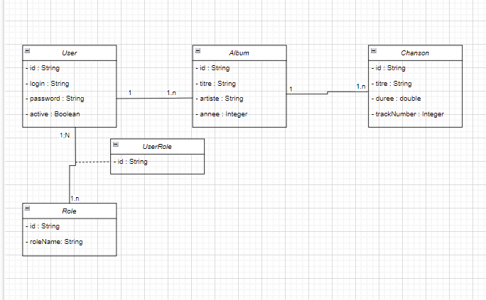

# API REST pour la Gestion d'un Catalogue Musical

## Contexte du Projet
Une entreprise souhaite mettre en place une API REST pour gérer son catalogue musical. Cette API permettra :
- La gestion des albums et des chansons
- Différents niveaux d'accès (USER/ADMIN) via une authentification sécurisée et stateless

L'architecture technique repose sur **Spring Boot** et intègre les meilleures pratiques **DevOps** modernes.

---

## Entités Principales
- **Album** : `titre (String)`, `artiste (String)`, `annee (Integer)`
- **Chanson** : `titre (String)`, `duree (Integer)`, `trackNumber (Integer)`
- **User** : `login (String)`, `password (String)`, `active (Boolean)`, `roles (Collection)`

### Relations
- Un album peut contenir plusieurs chansons.
- Une chanson appartient à un seul album.

---

## Fonctionnalités Requises

### Gestion des Albums
- **Lister les albums** avec pagination *(USER/ADMIN)*
- **Rechercher un album** par titre, artiste ou année avec pagination et tri *(USER/ADMIN)*
- **Ajouter un album** *(ADMIN uniquement)*
- **Modifier un album existant** *(ADMIN uniquement)*
- **Supprimer un album** *(ADMIN uniquement)*

**Endpoints :**
- `/api/user/albums/**`
- `/api/admin/albums/**`

### Gestion des Chansons
- **Lister les chansons** avec pagination *(USER/ADMIN)*
- **Rechercher une chanson** par titre avec pagination et tri *(USER/ADMIN)*
- **Lister les chansons d'un album** avec pagination *(USER/ADMIN)*
- **Ajouter une chanson** *(ADMIN uniquement)*
- **Modifier une chanson existante** *(ADMIN uniquement)*
- **Supprimer une chanson** *(ADMIN uniquement)*

**Endpoints :**
- `/api/user/songs/**`
- `/api/admin/songs/**`

### Gestion des Utilisateurs
- Authentification : `/api/auth/login`
- Création de compte : `POST /api/auth/register`
- Liste des utilisateurs *(ADMIN uniquement)* : `GET /api/admin/users`
- Gestion des rôles *(ADMIN uniquement)* : `PUT /api/admin/users/{id}/roles`

---

## Sécurité
- **Spring Security** avec authentification stateless basée sur **JWT**.
- Cryptage des mots de passe avec **BCryptPasswordEncoder** ou un autre encodeur robuste.

### JWT
Un bon token JWT doit :
- Identifier le service émetteur via `.withIssuer()`
- Contenir l'identité de l'utilisateur via `.withSubject()`
- Stocker les rôles/permissions via `.withArrayClaim()`
- Avoir une durée de validité limitée via `.withExpiresAt()`
- Être signé de manière sécurisée via `.sign()` (HMAC ou RSA)

**Tests JWT :**
- Utiliser des outils locaux/offline pour décoder les tokens (Postman, IntelliJ, VSC, etc.).

### Règles d'accès
- **URLs ADMIN** : `/api/admin/*` nécessitent le rôle `ADMIN`
- **URLs USER** : `/api/user/*` nécessitent le rôle `USER`

---

## Couches Applicatives
1. **Controller** : Gestion des requêtes HTTP.
2. **Service** : Contient la logique métier.
3. **Repository** : Accès aux données (MongoDB via Spring Data).
4. **DTO** : Objets de transfert de données.
5. **Mapper** : Conversion entre entités et DTO.
6. **Exception** : Gestion centralisée des erreurs.
7. **Validation** : Validation des données avec Bean Validation.
8. **Utils** : Classes utilitaires (DateUtils, SecurityUtils, etc.).
9. **Tests** : Tests unitaires et d'intégration.

---

## Technologies Utilisées
- **Spring Boot** : Framework principal
- **MongoDB** : Base de données NoSQL
- **JWT** : Authentification sécurisée
- **Spring Security** : Gestion des accès
- **Docker** : Conteneurisation
- **Jenkins** : Intégration et déploiement continu
- **Postman** : Tests API
- **Swagger** : Documentation API

---

## Exigences Techniques
- **Profiles** : dev, prod
- **Validation** : Bean Validation (`@Valid`, `@NotNull`, validateurs personnalisés)
- **Design Patterns** : Repository, DTO, Mapper
- **Tests** : JUnit, Mockito (unitaires et d'intégration)
- **Logs** : Système de logging avec LOGGER
- **Java Features** : Stream API, Lambda expressions, Java Time API, Optional

---

## Outils DevOps
- **Git** : Gestion de version avec branches
- **JIRA** : Gestion de projet avec Scrum
- **DockerHub** : Stockage des images Docker générées
- **SonarLint** : Analyse de code

---

## Installation et Démarrage
### Prérequis
- Java 17+
- Maven
- MongoDB
- Docker

### Étapes
1. Clonez le projet :
   ```bash
   git clone https://github.com/AkilSalah/AkilMusic.git
   ```
2. Accédez au dossier du projet :
   ```bash
   cd AkilMusic
   ```
3. Lancez MongoDB (localement ou avec Docker) :
   ```bash
   docker run -d -p 27017:27017 --name mongodb mongo
   ```
4. Configurez les propriétés de l'application dans `application-dev.yml`.
5. Compilez et démarrez l'application :
   ```bash
   mvn spring-boot:run
   ```
---

## Tests
Exécutez les tests unitaires et d'intégration :
```bash
mvn test
```

---

## Conteneurisation avec Docker
1. Construisez l'image Docker :
   ```bash
   docker build -t AkilMusic .
   ```
2. Lancez un conteneur :
   ```bash
   docker run -p 8080:8080 --name AkilMusic AkilMusic
   ```

---
## Conception UML
### Diagramme de classe



